## Status

- Sophomore Student at Beijing University of Posts and Telecommunications
- Intern at Microsoft, previously at [@second-state](https://github.com/second-state).
- Public Key: 339983A9A0682C123A27798AB17702ED15AC13F9 on [keyserver.ubuntu.com](https://keyserver.ubuntu.com/pks/lookup?search=0x339983a9a0682c123a27798ab17702ed15ac13f9&fingerprint=on&op=index)
- Total code time since using WakaTime: 

## Interests

   

## Dev Environment

 

## Server Environment

   
